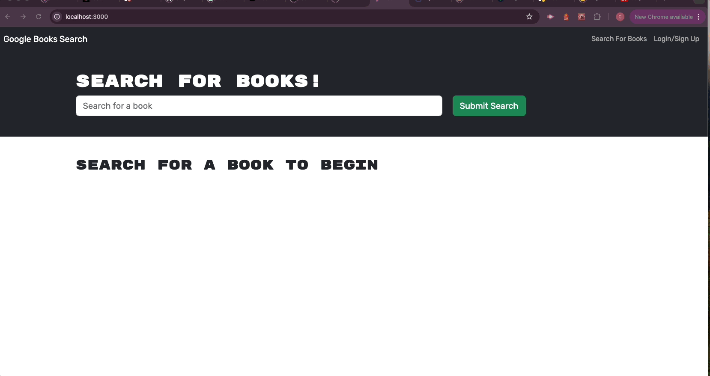

# Book_Search_App

## Web Book Search App with storage Function

The application lets you search the web for your favorit books. 
When you are logged in or signed up you can store the findings,  
to be able to look them up anytime needed.

## Table of Contents

- [Installation](#installation)
- [Usage](#usage)
- [Credits](#credits)
- [License](#license)
- [Badges](#badges)
- [Contributions](#contributions)
- [Questions](#questions)
- [Tests](#tests)

## Installation

Installation steps are the following: 
- Download the application from my GitHub (link below) 
- Naviagate to the `dev` folder 
- Run `npm install`
- Run `npm run develop`
- The application runs locally on `localhost`

## Usage

The usage of the application is very simple. Search for a book by typing it 
into the `Input` Box. 
In case you want to save books you have to log in,  
or create an account. 
To create an account sign-up using the sign-up button and fill your credentials. 
As existing user you can directly log-in. 
When logged in you can search for books and save them to your account. 
Under `See Your Books` you can then find all your saved books. 
You can also delete books from your account.

Search for books and how to store: 

Log in and book storage 

## Credits

https://stackoverflow.com 
https://developer.mozilla.org 

## License

https://opensource.org/license/mit

## Badges

## Contributions

Contact me via mail (link is below)

## Questions

Flo2009

https://github/Flo2009

supersuse81@gmail.com

## Tests

Deployed application is available under this link:

https://book-search-app-vnv9.onrender.com

GitHub Link

https://github.com/Flo2009/Book_Search_App
